# FLASH

I wrote Flash[^1] to study using the same simple system I still use for physical flashcards: adding questions and answers myself, organizing them in sets by subject, reviewing repeatedly while setting aside those I know until none remain.

[^1]: Long ago, before Macromedia "Flash". 

Questions are shown in random order along with related metadata. While a question is displayed the user can select the Right Arrow button to display the answer, or the 'q' button to return to the main menu.

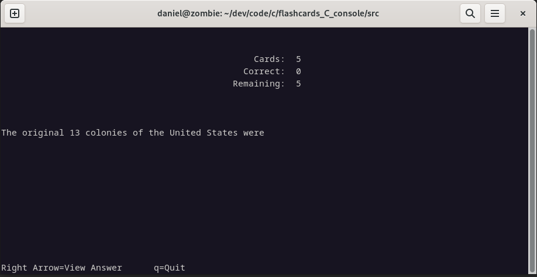

While an answer is displayed the user can select the Left Arrow to display the question again, the Up Arrow to put it aside as learned, or the Down Arrow to try it again later.

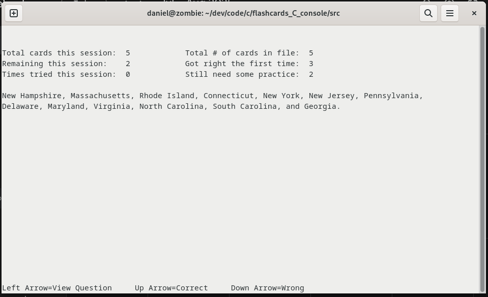

Questions and answers are loaded from a CSV file. 

Flash must be started manually within a terminal. Specifying a CSV on startup is optional.

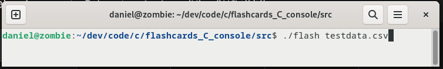

The menu has options to select a file, to study it, to clear the metadata for it or to quit.

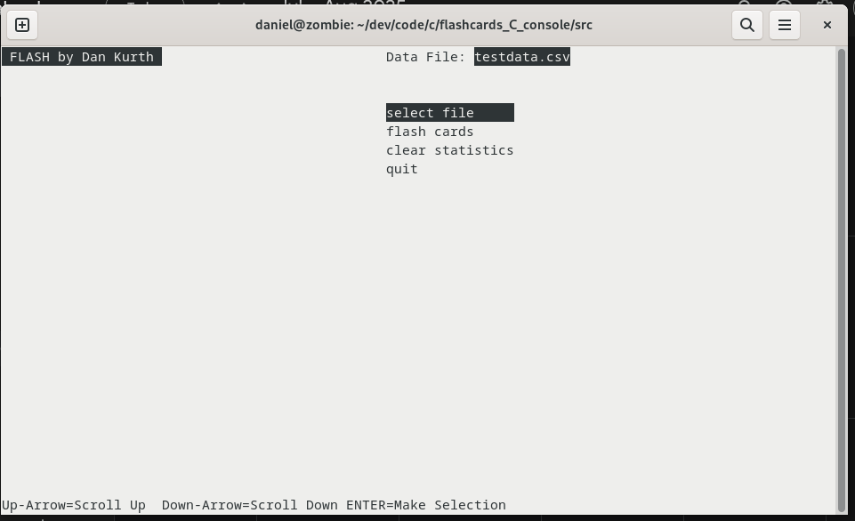


## CSV

The CSV may be created and edited using a text editor.

```
1,one (in Spanish),uno
1,"you (plural, familiar, in Spanish):
  a. tú
  b. usted
  c. vostros
  d. vosotras
  e. vos
  ",c
0,The original 13 colonies of the United States were,"New Hampshire, Massachusetts, Rhode Island, Connecticut, New York, New Jersey, Pennsylvania,
Delaware, Maryland, Virginia, North Carolina, South Carolina, and Georgia."
1,you or him,tú o Él
1,you or him (2),tú o él o Él
```


If using a text editor to modify CSV files directly it is possible you'll see an error due to a missing field. 

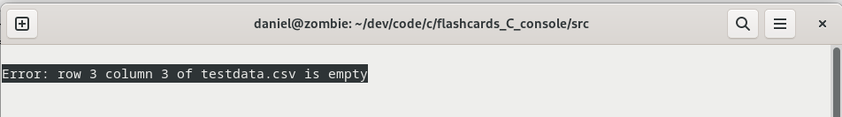

In this example the error is caused by a newline immediately after the comma delimiting the question. The parser expects an answer field but gets an unquoted newline instead which terminates row 3 at line 9 with no answer for column 3. The file cannot be used until fixed.

In part an error for this condition is desireable as otherwise the file cannot be properly imported into a spreadsheet. As shown the answer on line 10 would be imported into column 1 and the spreadsheet would be a mess. Fixing the CSV file so that it can be loaded by Flash also fixes it for import into a spreadsheet.

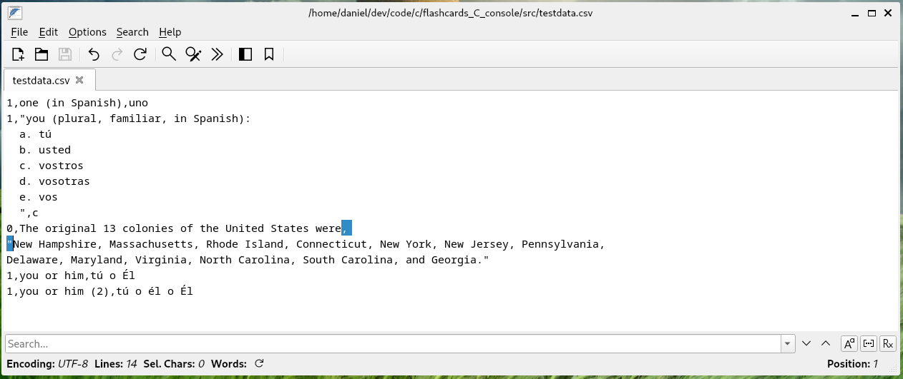

In the following example the third row (on line 9) has a newline after the question so that the user can view the lines in the same alignment that they will appear when displayed in Flash. This is okay because there is an opening quote after the comma delimiting the question, so the newline on line 9 is treated as content within the answer. This makes it easier to edit content, but there's a small downside in that the answer will be displayed starting at one row down from where it would be displayed otherwise.

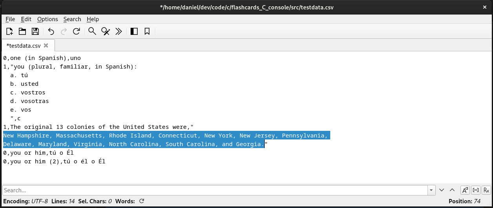

A better solution while modifying the CVS using a text editor is to first align any quoted text (question or answer) on the left and format it using newlines as you'd like it to appear on display, and then as final step backspace the first character in the answer so that it starts immediately after an opening quote on the same line as the question. This way there will not be any empty lines prior to the answer when it is displayed and any newlines in the answer to format content will be displayed as intended (though they may now look out of alignment as viewed in a text editor).

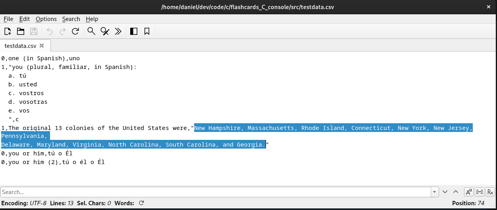

## Spreadsheet

Content may also be created or edited using a spreadsheet, then saved as a CSV file.

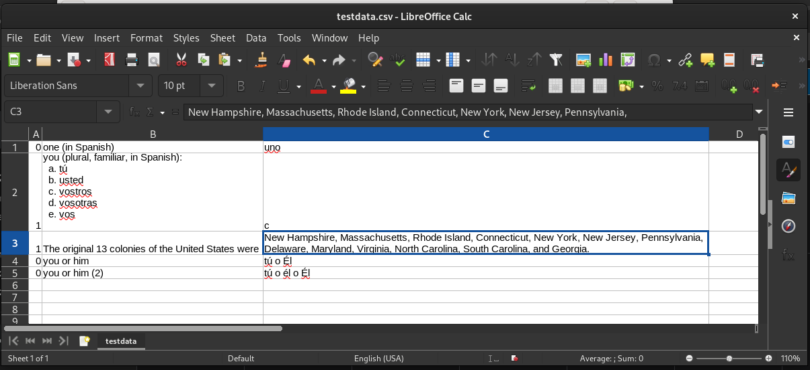

### Import

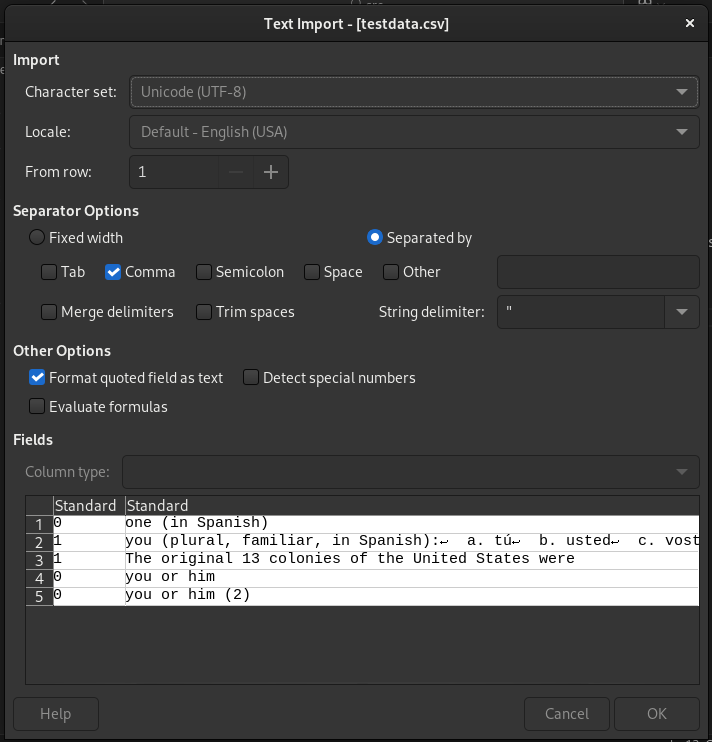

As noted in the previous section the CSV must be properly formatted to avoid errors on import such as that in the following example (in this case caused by an unquoted newline after a question and prior to the corresponding answer).

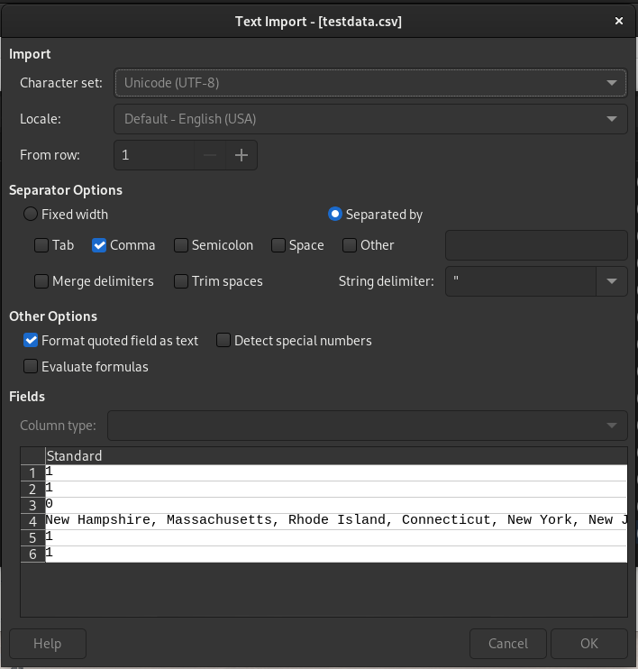

### Save As

The file must be saved as a CSV file.

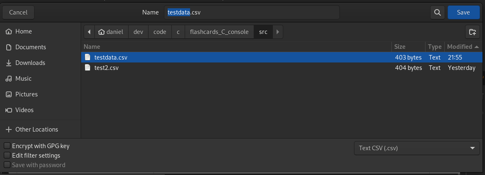

By default on Save As in Calc will put quotes around all text fields in the saved CSV file. This adds needless clutter.

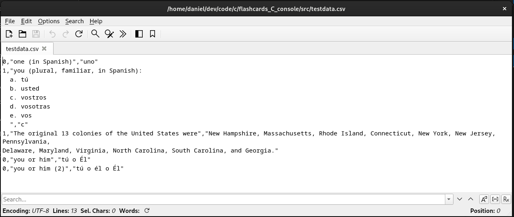

Quotes are only necessary for fields that contain commas or newlines.

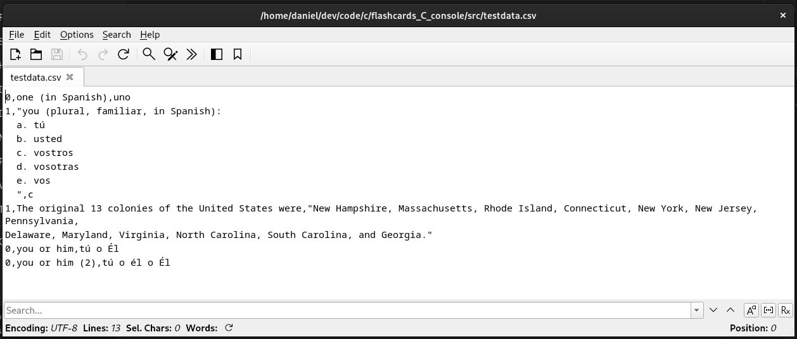

The best settings for Save As from LibreOffice Calc are as shown below, in the Export Text File dialog.

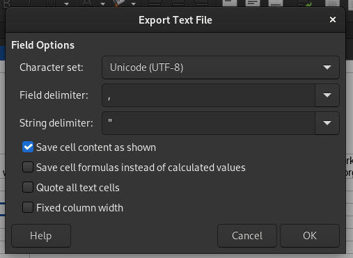
