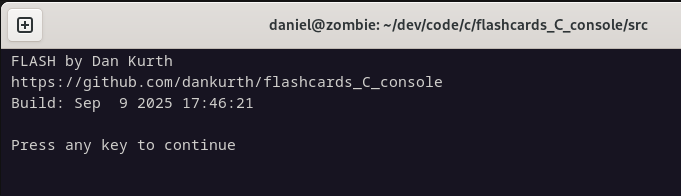

# FLASH

FLASH[^1] is a simple to use general purpose flashcards program.

[^1]: The name is perhaps unfortunate, but I chose it many years ago when I wrote the first version (for DOS, using Turbo C and MASM), long before Flash by MacroMedia became famous. I even made a icon for it with a stylized lightning bolt next to the name! Oh well.

The current version is text and desktop-only. It is developed on Debian 12 primarily for Linux (because that's where I personally use it :) but also easily cross-compiles for Windows.[^2]

[^2]: Details in "Build on Linux to run on Windows" section.

## Flashing

Questions are shown in random order along with optional instructions for what to do specific to the question shown. 
Information about the number of cards in the file chosen and how many are already answered correctly versus remaining is also shown on the same page.

While a question is displayed the user can select the Right Arrow button to display the answer, or the 'q' button to return to the main menu. 


While an answer is displayed the user can select the Left Arrow to display the question again, the Up Arrow to put it aside as learned, or the Down Arrow to try it again later.


Questions and answers are loaded from CSV files, each of which may contain many flashcards (question/answer pairs). 


The menu has options to select a file, to study it, to clear the metadata for it, to view info such as when it was built or to quit.


Read all about it



### Security

Unlike many programs there is no "install" process or root/admin access required. 

Both the flashcards and the pass/fail history for those cards are stored together in CSV files, and the program can read and update only those CSV files for which the user has read/write access, if and when the user chooses to use those files.[^3]

[^3]: The program is also further restricted internally in that it will refuse to use content that is not encoded as UTF-8 or that is not properly organized with the CSV delimited fields and field types or values that it expects.

Because pass/fail history for each card is saved in the same file as the flashcards it is necessary that each user use only their own files. This should not normally be an issue because users have access only to their files, but If for some reason users share a user account or share files or folders then they can work still work around this issue by keeping copies of the files in separate folders for usage by separate individuals.

## Editing

### CSV

The CSV may be created and edited using a text editor.

```
0,one,uno,translate (Spanish)
0,two,dos
0,"you (plural, familiar, in Spanish):
  a. tú
  b. usted
  c. vosotros
  d. vosotras
  e. vos
  ",c,"Choose letter corresponding to correct answer, e.g. 'b', or 'e', or whatever you think it is."
0,The original 13 colonies of the United States were,"New Hampshire, Massachusetts, Rhode Island, Connecticut, New York, New Jersey, Pennsylvania,
Delaware, Maryland, Virginia, North Carolina, South Carolina, and Georgia.",
0,you or him,tú o él

```

If using a text editor to modify CSV files directly it is possible you'll see an error due to a missing field. 


In this example the error is caused by a newline immediately after the comma delimiting the question. The parser expects an answer field but gets an unquoted newline instead which terminates row 3 at line 9 with no answer for column 3. The file cannot be used until fixed.

In part an error for this condition is desireable as otherwise the file cannot be properly imported into a spreadsheet. As shown the answer on line 10 would be imported into column 1 and the spreadsheet would be a mess. Fixing the CSV file so that it can be loaded by Flash also fixes it for import into a spreadsheet.


In the following example the third row (on line 9) has a newline after the question so that the user can view the lines in the same alignment that they will appear when displayed in Flash. This is okay because there is an opening quote after the comma delimiting the question, so the newline on line 9 is treated as content within the answer. This makes it easier to edit content, but there's a small downside in that the answer will be displayed starting at one row down from where it would be displayed otherwise.


A better solution while modifying the CVS using a text editor is to first align any quoted text (question or answer) on the left and format it using newlines as you'd like it to appear on display, and then as final step backspace the first character in the answer so that it starts immediately after an opening quote on the same line as the question. This way there will not be any empty lines prior to the answer when it is displayed and any newlines in the answer to format content will be displayed as intended (though they may now look out of alignment as viewed in a text editor).


### Spreadsheet

Content may also be created or edited using a spreadsheet, then saved as a CSV file.


#### Import


As noted in the previous section the CSV must be properly formatted to avoid errors on import such as that in the following example (in this case caused by an unquoted newline after a question and prior to the corresponding answer).


#### Save As

The file must be saved as a CSV file.


By default on Save As in Calc will put quotes around all text fields in the saved CSV file. This adds needless clutter.


Quotes are only necessary for fields that contain commas or newlines.


The best settings for Save As from LibreOffice Calc are as shown below, in the Export Text File dialog.


## Building

To provide all relevant context in my examples I'm showing unedited entries as I actually do them on my own pc. Please adapt to your own folder layouts. 

Also in that regard while most people use sudo to run commands as root I do not so for those commands where the prompt ends with `:~#` (indicating root) please use `sudo` as required.

Source code is on GitHub.
```
daniel@zombie:~/dev/code/c$ git clone https://github.com/dankurth/flashcards_C_console.git
```

### Build on Linux to run on Linux

#### Examples
Build on my Debian 12 machine to run (and debug) on Linux
```
daniel@zombie:~/dev/code/c/flashcards_C_console/src$ gcc -o flash fcm.c -I/usr/include/ncursesw/ncursesw -lncursesw -ltermcap -Wall -g
```

### Build on Linux to run on Windows

To build for Windows first obtain Mingw-64.
```
root@zombie:~# apt install mingw-w64
```

Also need a Windows compatible version of ncurses.
```
daniel@zombie:~/dev$ git clone https://github.com/wmcbrine/PDCurses.git
```

Modify PDCurses/wincon/Makefile to match target.
```
#CC		= gcc
#for 64-bit:
CC		= x86_64-w64-mingw32-gcc
#for 32-bit:
#CC		= i686-w64-mingw32-gcc
```

After modifying Makefile run `make clean` followed by `make -f Makefile WIDE=Y UTF8=Y` (while in the PDCurses/wincon folder).

#### Examples

Build on my Debian 12 machine to run on Windows 10/11 (64-bit):
```
daniel@zombie:~/dev/code/c/flashcards_C_console/src$ x86_64-w64-mingw32-gcc -o flash.exe fcm.c -I/home/daniel/dev/PDCurses /home/daniel/dev/PDCurses/wincon/pdcurses.a
```

Build on my Debian 12 machine to run on Windows XP (32-bit):
```
daniel@zombie:~/dev/code/c/flashcards_C_console/src$ i686-w64-mingw32-gcc -o flash.exe fcm.c -I/home/daniel/dev/PDCurses /home/daniel/dev/PDCurses/wincon/pdcurses.a
```

